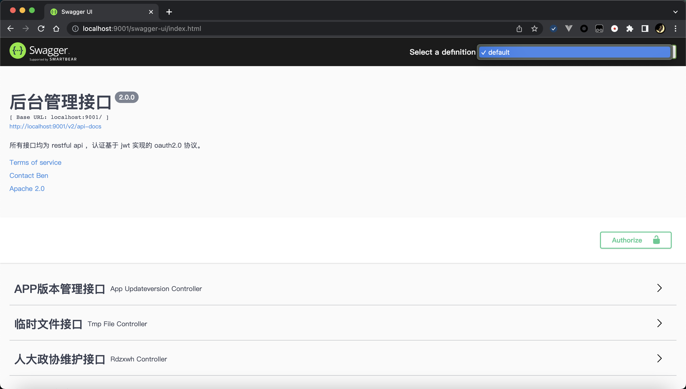
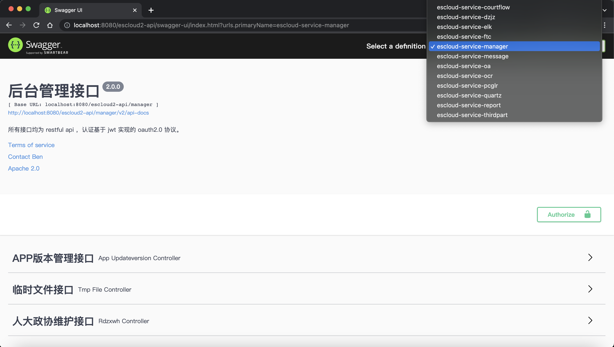
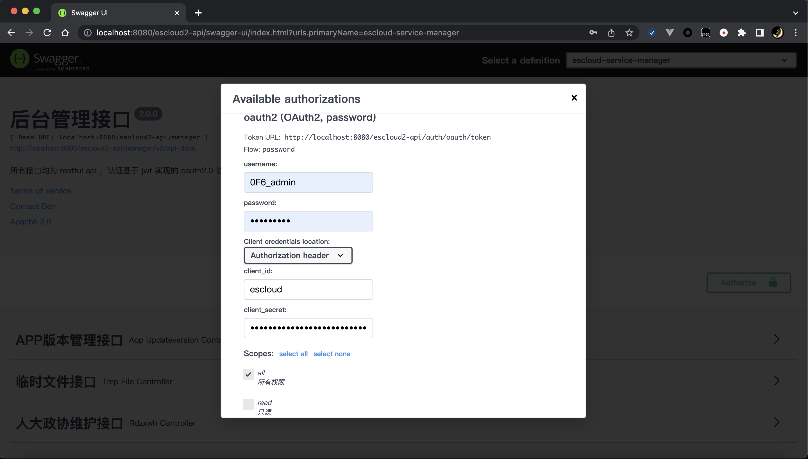

[](https://search.maven.org/artifact/io.github.benfromchina/swagger-spring-boot-starter/2.0.2/jar)
[](https://gitee.com/jarvis-lib/swagger-spring-boot-starter/releases/v2.0.2)
[](https://www.apache.org/licenses/LICENSE-2.0.html)

# 目录

- [功能](#功能)
- [效果展示](#效果展示)
- [配置](#配置)

# 功能

- 支持 Swagger 自动配置
- 支持 OAuth2.0 登录
- 支持 Zuul 网关汇集微服务接口
- 支持 Gateway 网关汇集微服务接口

# 效果展示

- Spring Boot 单体应用

  

- Zuul 或 Gateway 网关收集微服务接口
  
  
  
- OAuth2.0 登录
  
  


# 配置

1. pom.xml 中引入依赖

- jdk17 以下使用 1.0 版本

```xml
<dependency>
    <groupId>io.github.benfromchina</groupId>
    <artifactId>swagger-spring-boot-starter</artifactId>
    <version>1.0.2</version>
</dependency>
```

- jdk17 及以上使用 2.0 版本

```xml
<dependency>
    <groupId>io.github.benfromchina</groupId>
    <artifactId>swagger-spring-boot-starter</artifactId>
    <version>2.0.2</version>
</dependency>
```

2. yaml 配置

```yml
swagger:
  base-package: com.stark.demo.controller                   # 扫描包路径
  title: demo api                                           # 标题
  description: restful api                                  # 描述
  version: 1.0                                              # 版本号
  terms-of-service-url: urn:tos                             # 接口使用条件说明
  contact-name: tony                                        # 接口维护人姓名
  contact-email: tony@stark.com                             # 接口维护人电子邮件
  license: Apache 2.0                                       # 证书名称
  license-url: http://www.apache.org/licenses/LICENSE-2.0   # 证书链接地址
  vendor-extensions:                                        # 额外功能扩展
  index-redirect: true                                      # 是否将首页 {"/", "/index"} 重定向到 swagger 接口文档页
  referer: https://io.github.benfromchina                   # 公共的 referer 请求头
  referer-name: Referer                                     # referer 请求头参数名
  oauth2:                                                   # oauth2登录配置
    enabled: false                                          # 是否开启
    type: password                                          # 支持 authorization_code(授权码)、password(密码)
    access-token-url: http://xxx/auth/oauth/token           # 获取 token 链接地址
    authorize-url: http://xxx/auth/oauth/authorize          # 认证授权链接地址
    client-id: jarvis                                       # 客户端ID
    client-secret: 7fc1a04f90df4e8ba7b310ab6fbb17b4         # 客户端秘钥
    scopes:                                                 # 授权作用域列表，scope 和 description 自定义
      - scope: all
        description: 所有权限
  zuul:                                                     # zuul网关收集微服务接口统一展示
    enabled: false                                          # 是否开启
    service-id-regex: .*-service-.*                         # 微服务ID正则，匹配的微服务收集swagger
  gateway:                                                  # gateway网关收集微服务接口统一展示
    enabled: false                                          # 是否开启
    service-id-regex: .*-service-.*                         # 微服务ID正则，匹配的微服务收集swagger
```

3. `WebFlux` 项目需要额外配置

```yml
server:
  forward-headers-strategy: framework
```

4. 资源服务器安全配置

    - Zuul 作为资源服务器

    ```java
    @Configuration
    @EnableResourceServer
    public class ResourceServerConfig extends ResourceServerConfigurerAdapter {
	
        @Autowired
        private SwaggerProperties swaggerProperties;
        @Autowired
        private ZuulProperties zuulProperties;
	
        @Override
        public void configure(HttpSecurity http) throws Exception {
            http
                .authorizeRequests()
                    .antMatchers(SwaggerPaths.createSwaggerPatterns(swaggerProperties, zuulProperties))	// swagger 文档
                        .permitAll();
        }
    
    }
    ```

    - Gateway 作为资源服务器

    ```java
    @Configuration
    @EnableWebFluxSecurity
    public class ResourceServerConfig {
	
        @Autowired
        private GatewayProperties gatewayProperties;
        @Autowired
        private GatewayExtentionProperties gatewayExtentionProperties;
        @Autowired
        private SwaggerProperties swaggerProperties;
	
        @Bean
        SecurityWebFilterChain springSecurityFilterChain(ServerHttpSecurity http) throws Exception {
            http
                .authorizeExchange()
                    .pathMatchers(SwaggerPaths.createSwaggerPatterns(swaggerProperties, gatewayProperties, gatewayExtentionProperties))	// swagger 文档
                        .permitAll();
            return http.build();
        }

    }
    ```
